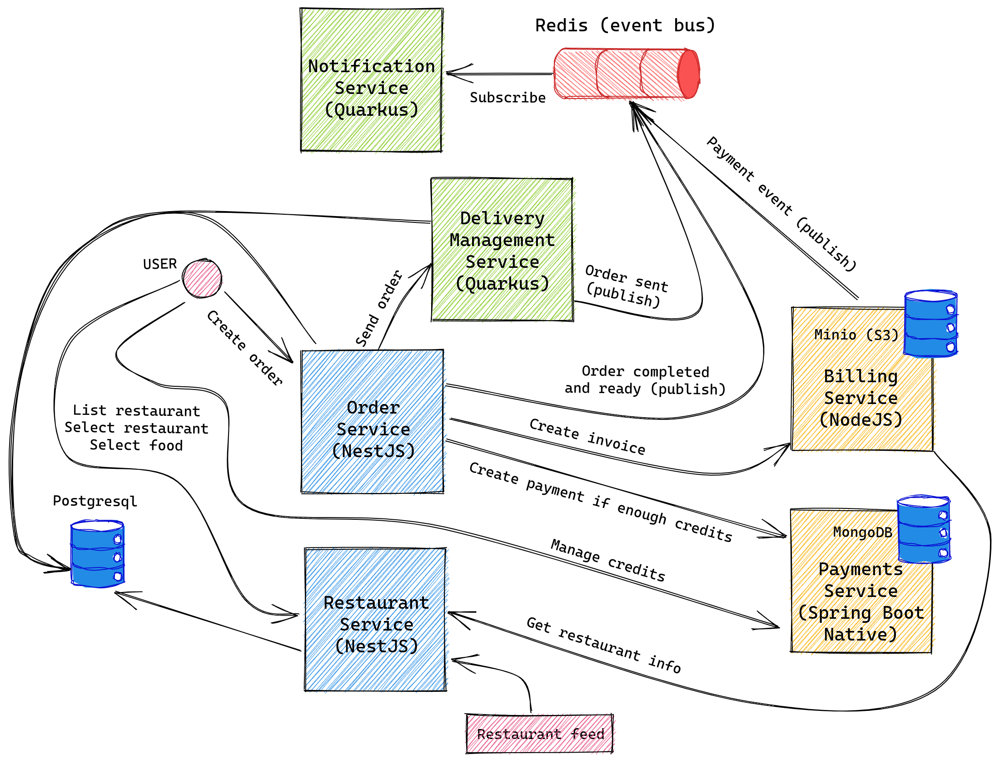

# Better dajme jidlo

Monorepo of Better dajme jidlo

## Services




## Build

```
docker network create better-dajme-jidlo

# Database
docker-compose -f docker/database.yml up -d

# Tasks
docker-compose -f docker/tasks.yml up -d

# Application
docker-compose -f docker/application.yml up -d
```

## Running

```shell
docker-compose up
```


## Ports & Hostnames

```
127.0.20.0 databases.local
127.0.20.1 user.service.local
127.0.20.2 restaurant.feed.local
127.0.20.3 restaurant.service.local
127.0.20.4 payment.service.local
127.0.20.5 notification.service.local
127.0.20.6 billing.service.local
127.0.20.7 order.service.local
```
